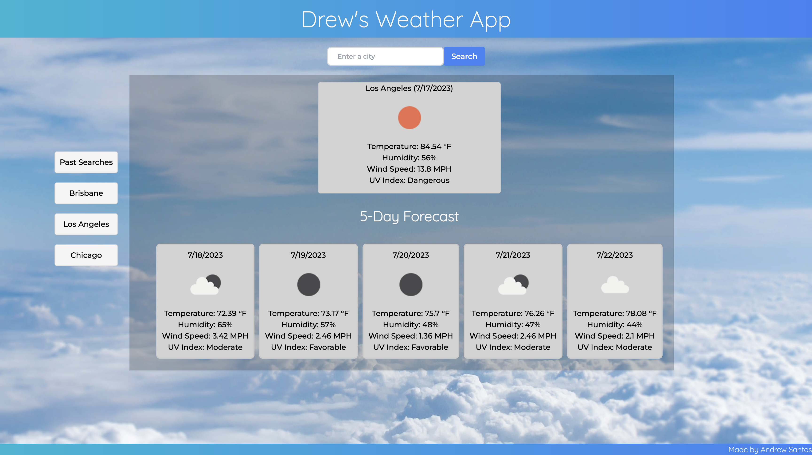

# weather-dashboard

## Description
This is a dynamic weather dashboard that allows the user to search for a city and see the current weather and a forecast for the next 5 days. The user can also see their search history and click on a city to see the weather for that city again. The weather is pulled from the OpenWeather API and the background changes responsively based on the current conditions as shown in the images below.

## Usage

[Click here to view the deployed application](https://drewsantos3.github.io/weather-dashboard/)

## License
MIT License

## Questions
If you have any questions, please contact me at drewsantos3@gmail.com.